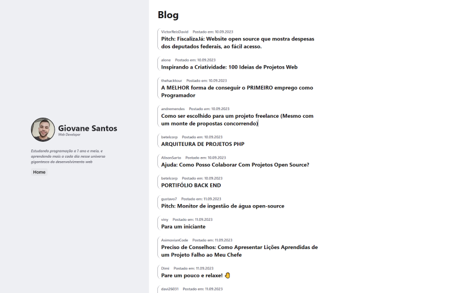

## TabNews Blog

<br />

Criei um blog feito com NextJS, Thon UI e as APIs to TabNews.

Apenas para estudos e adquirir experiência na prática.

Acesse o projeto aqui: [tabNews Blog](https://tabnews-blog.vercel.app/)


## Executando o projeto

Para clonar e rodar o projeto siga os passos abaixo:

Passo 1 - Clone o repositório em uma pasta executando o comando:

```bash
git clone https://github.com/gio98sp/tabnews-blog.git
```

Passo 2 - Instale as dependências:

```bash
npm i
```

Passo 3 - Executando no modo de desenvolvimento:

```bash
npm run dev
```
